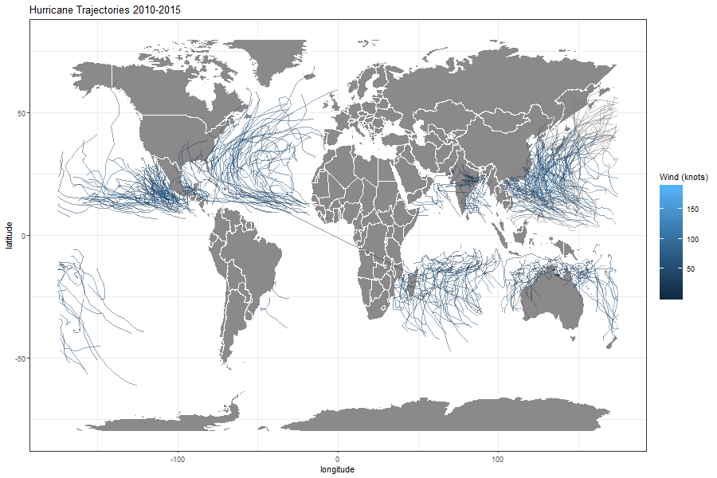
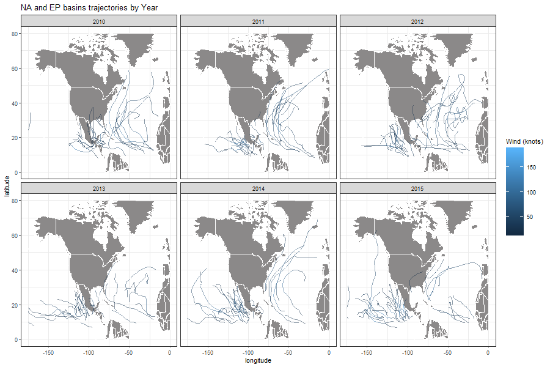
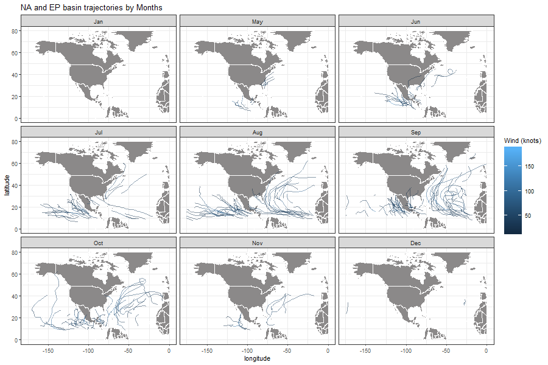

```{r setup, include=FALSE, echo = FALSE}
knitr::opts_chunk$set(echo = TRUE)
```

```{r echo = FALSE, message=FALSE, warning=FALSE}
library(dplyr)
library(readr)
library(ggplot2)
library(maps)
library(lubridate)
```

In this workout, we will be using ibtracs data from the years 2010 to 2015 to perform some data analysis and explorations of information about storms in that time period.

                  
```{r echo = FALSE}
#vector for ibtracs-2010-2015 data column names
column_names <- c("serial_num", 
                  "season", 
                  "num", 
                  "basin", 
                  "sub_basin", 
                  "name", 
                  "iso_time", 
                  "nature", 
                  "latitude", 
                  "longitude", 
                  "wind", 
                  "press")
```
                  

```{r echo = FALSE}
#list for ibtracs-2010-2015 data column types
column_types <- list (
       serial_num = col_character(),
       season = col_integer(),
       num = col_character(),
       basin = col_factor(),
       sub_basin = col_character(),
       name = col_character(),
       iso_time = col_character(),
       nature = col_character(),
       latitude = col_double(),
       longitude = col_double(),
       wind = col_double(),
       press = col_double()
)
```


```{r echo = FALSE}

#load ibtracs-2010-2015 data from working directory data subdirectory
data<- read_csv(file = "../data/ibtracs-2010-2015.csv" , 
         na = c("-999.", "-1.0", "0.0", "-1", "0"), 
         col_names = column_names, 
         col_types = column_types, 
         skip = 1
         )
```


```{r echo = FALSE}
data$season = as.numeric(data$season)
data$latitude = as.numeric(gsub("^", "", data$latitude))
data$longitude = as.numeric(gsub("^", "", data$longitude))
data$wind = as.numeric(gsub("^", "", data$wind))
data$ID = as.factor(paste(data$name, data$season, sep = "."))
data$name = as.factor(data$name)
data <- mutate(data, date_time = ymd_hms(iso_time))
data <- mutate(data, month_str = month(date_time, label = TRUE))
data <- mutate(data, days_str = day(date_time))
```

\
\

### Unique storm occurences from 2010 - 2015
***

While the dataset is very large, it's records of storms is based on their activity for a given period of time (days).
To get the actual total number of storms in our desired period,  a count can be done for unique storms observed which gives the following result: 

#### Total records of unique storms 2010-2015
```{r echo=FALSE}
nrow(tally(group_by(data,season, name)))
```

From the total number of unique storms, we can classify their records by season(year) accordingly as follows:

#### Unique storm records by year
```{r echo=FALSE}
by_years <- data %>% select(name, season) %>% group_by(season) %>% unique() %>% tally(name = "count")
by_years
```


The records for storms from 2010-2015 was consistent around an average of 85 with lowest records of 84 in 2010 and the highest record of 100 in 2013.


Classifying the records of storms can be done further by months accross all years which gives the followeing:

#### Records of storms in different months
```{r echo = FALSE}
data %>% select(name, month_str) %>% group_by(month_str) %>% unique() %>% tally(name = "count")
```

For the total records in the 2010-2015 data, the distribution of storm occurences shows highest activity from the months July to October. September with 106 occurences has the highest storm records in accross these years while April with 26 has the lowest records. This data shows a given storm season (peak) can be predicted if those records are consistent accross all years in a larger data sample. 

\
\


### Storms per Hemispheres
***

We can also specify the number of those unique storms that were recorded in specific hemishpehres.

For instance, from the 549 storms result we've determined, we can also determine the following:

#### Unique Storms recorded in the Northern hemisphere
```{r echo= FALSE}
data %>% select(name, season, latitude) %>% filter(latitude > 0) %>% group_by(season, name) %>% tally() %>% nrow()
```

This then means the remaining storms can be determined as follows:

#### Unique Storms recorded in the Southern Hemisphere
```{r echo = FALSE}
data %>% select(name, season, latitude) %>% filter(latitude < 0) %>% group_by(season, name) %>% tally() %>% nrow()
```

The Northern hemisphere is then more active for storm occurences with nearly thrice as much records of storms in the 2010-2015 period.

\
\

It is also possible for some storms to pass through the equator, we can check for any such records as follows:

#### storms that passed through the equator
```{r echo= FALSE}
data %>% select(name, season, latitude) %>% filter(latitude == 0) %>% group_by(season, name) %>% tally() %>% nrow()
```


### Records of storms in different basins
****

Just as storms are more active in a given hemisphere, storm activity can be classified by the seven different basins to determine activity levels as follows:

```{r echo = FALSE}
data %>% select(name, basin) %>% group_by(basin) %>% unique() %>% tally(name = "count")
```

This classification shows that the SA basin is very unlikely to have active storms with only 1 occurence in five years.
The WP (Western Pacific) and EP (Eastern Pacific) basins on the contrary are have a very high storm occurence recordds with nearly 60% of all storms recorded in those two basins. The North Atlantic and South Indian basins are also notable for a high record of storms in the periods covered by this dataset.


### Storm activity 
****

Lets further analyse storm activity starting with the durations recorded for unique storms in this data set.

##### Longest duration for storms (days)
```{r echo = FALSE}
max(data$days_str)
```


##### Average duration for storms(days)
```{r echo = FALSE}
mean(data$days_str)
```


##### shortest duration for storms(days)
```{r echo = FALSE}
min(data$days_str)
```
The above data is a quick summary of durations of storms recorded. The shortest duration is 1 day, while the longest duration of a storm was recorded to be 31 days. The average duration of all unique storms is set around 15 days.

We can take a sample to see some of the unique storms and their recorded durations.


#### Top 10 storms with shortest durations(days)
```{r echo = FALSE}
data %>% arrange(desc(days_str)) %>% select(name, season, days_str) %>% group_by(name, season, days_str) %>% summarize(Avg_days= mean(days_str)) %>% arrange(desc(days_str)) %>% tail(10) %>% select(name, season, Avg_days)
```


#### Top 10 storms with longest durations(days)
```{r echo = FALSE}
data %>% arrange(desc(days_str)) %>% select(name, season, days_str) %>% group_by(name, season, days_str) %>% summarize(Avg_days= mean(days_str)) %>% arrange(desc(days_str)) %>% head(10) %>% select(name, season, Avg_days)
```

\
\

An important data of record in the storms dataset is the  wind speed of storms. Given that the storms are recorded with different wind speeds throughout their activity duration, we can determine an average speed for unique storms as follows:

#### Top 10 storms with highest average wind speeds
```{r echo = FALSE}
data %>% arrange(desc(wind)) %>% head(25) %>% select(name, season, wind, days_str) %>% group_by(name, season) %>% summarize(Avg_wind= mean(wind)) %>% arrange(desc(Avg_wind))
```

In this classification done with a descending order by average wind speed, the storm PATRICIA in the 2015 season had the highest wind speeds from 2010 to 2015 with an average of 173 knots. This is well above the second highest average CELIA in 2010 with wind speeds averaging at 140 knots. The rest of the storms in the highest 10 list are all consistent at around 130-135 knots.


\
\
\
\


### Storm Trajectories 
****

In a final overview of the stroms dataset, we can use the large and consistent recordings of storms throughout their activity to determine the trajectories they followed. The following plot shows the trajectories of all unique storms from the year 2010 to 2015 around the globe.

```{r echo = FALSE, fig.align='center'}

```

\
\
\
\
\
\


The following plots focus on storm activity in the North Atlantic and Easern Pacific basins. The plots are divided by the different years recorded in our dataset. The trajectories of storm activities is shown as follows:

```{r echo = FALSE, fig.align='center'}

```

\
\
\
\
\


 And then finally the following plot classifies the records of storms by months and shows trajectories in those months accross the years in the dataset.
   With this visual we can clearly see the previously determined information about storms being more active from June/July to October, with their peak activity in August/September. 

```{r echo = FALSE, fig.align='center'}

```


