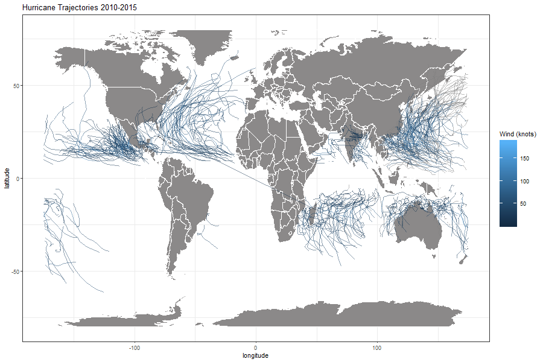
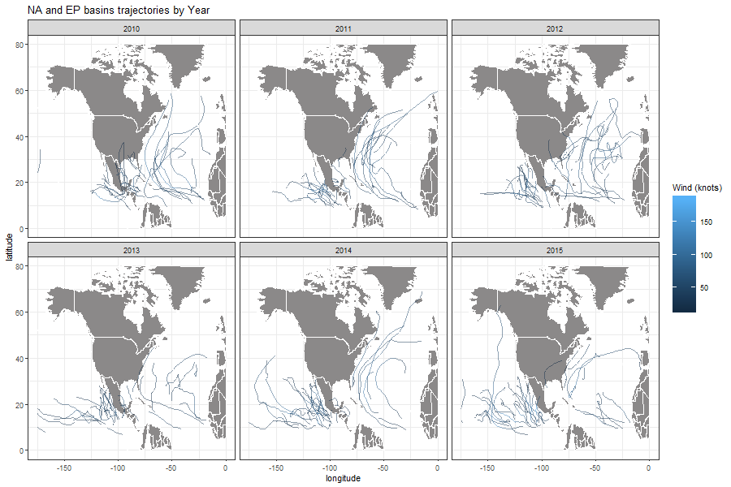
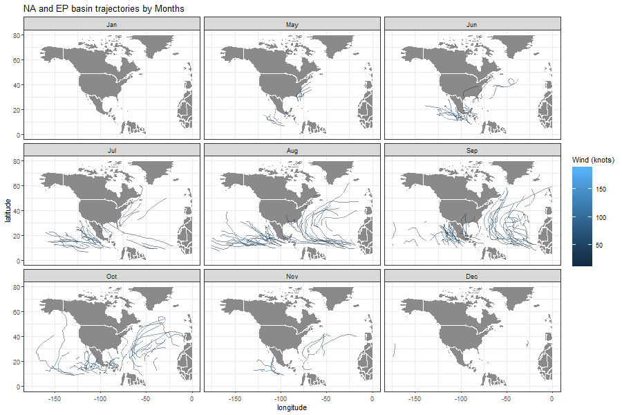

workout1-najiyullah-sanee
================
Najiyullah Sanee
10/17/2019

In this workout, we will be using ibtracs data from the years 2010 to
2015 to perform some data analysis and explorations of information about
storms in that time period.

  
  

### Unique storm occurences from 2010 - 2015

-----

While the dataset is very large, it’s records of storms is based on
their activity for a given period of time (days). To get the actual
total number of storms in our desired period, a count can be done for
unique storms observed which gives the following result:

#### Total records of unique storms 2010-2015

    ## [1] 549

From the total number of unique storms, we can classify their records by
season(year) accordingly as follows:

#### Unique storm records by year

    ## # A tibble: 6 x 2
    ##   season count
    ##    <dbl> <int>
    ## 1   2010    84
    ## 2   2011    88
    ## 3   2012    91
    ## 4   2013   100
    ## 5   2014    88
    ## 6   2015    98

The records for storms from 2010-2015 was consistent around an average
of 85 with lowest records of 84 in 2010 and the highest record of 100 in
2013.

Classifying the records of storms can be done further by months accross
all years which gives the followeing:

#### Records of storms in different months

    ## # A tibble: 12 x 2
    ##    month_str count
    ##    <ord>     <int>
    ##  1 Jan          54
    ##  2 Feb          48
    ##  3 Mar          35
    ##  4 Apr          26
    ##  5 May          28
    ##  6 Jun          49
    ##  7 Jul          65
    ##  8 Aug          95
    ##  9 Sep         106
    ## 10 Oct          89
    ## 11 Nov          44
    ## 12 Dec          44

For the total records in the 2010-2015 data, the distribution of storm
occurences shows highest activity from the months July to October.
September with 106 occurences has the highest storm records in accross
these years while April with 26 has the lowest records. This data shows
a given storm season (peak) can be predicted if those records are
consistent accross all years in a larger data sample.

  
  

### Storms per Hemispheres

-----

We can also specify the number of those unique storms that were recorded
in specific hemishpehres.

For instance, from the 549 storms result we’ve determined, we can also
determine the following:

#### Unique Storms recorded in the Northern hemisphere

    ## [1] 381

This then means the remaining storms can be determined as follows:

#### Unique Storms recorded in the Southern Hemisphere

    ## [1] 139

The Northern hemisphere is then more active for storm occurences with
nearly thrice as much records of storms in the 2010-2015 period.

  
  

It is also possible for some storms to pass through the equator, we can
check for any such records as follows:

#### storms that passed through the equator

    ## Warning: Factor `name` contains implicit NA, consider using
    ## `forcats::fct_explicit_na`

    ## [1] 1

### Records of storms in different basins

-----

Just as storms are more active in a given hemisphere, storm activity can
be classified by the seven different basins to determine activity levels
as follows:

    ## # A tibble: 7 x 2
    ##   basin count
    ##   <fct> <int>
    ## 1 SI       98
    ## 2 SP       56
    ## 3 WP      170
    ## 4 SA        1
    ## 5 NI       28
    ## 6 EP      131
    ## 7 NA       96

This classification shows that the SA basin is very unlikely to have
active storms with only 1 occurence in five years. The WP (Western
Pacific) and EP (Eastern Pacific) basins on the contrary are have a very
high storm occurence recordds with nearly 60% of all storms recorded in
those two basins. The North Atlantic and South Indian basins are also
notable for a high record of storms in the periods covered by this
dataset.

### Storm activity

-----

Lets further analyse storm activity starting with the durations recorded
for unique storms in this data set.

##### Longest duration for storms (days)

    ## [1] 31

##### Average duration for storms(days)

    ## [1] 15.89767

##### shortest duration for storms(days)

    ## [1] 1

The above data is a quick summary of durations of storms recorded. The
shortest duration is 1 day, while the longest duration of a storm was
recorded to be 31 days. The average duration of all unique storms is set
around 15 days.

We can take a sample to see some of the unique storms and their recorded
durations.

#### Top 10 storms with shortest durations(days)

    ## # A tibble: 10 x 3
    ## # Groups:   name, season [10]
    ##    name      season Avg_days
    ##    <fct>      <dbl>    <dbl>
    ##  1 TD:THIRTY   2013        1
    ##  2 TEMBIN      2012        1
    ##  3 TOMAS       2010        1
    ##  4 TORAJI      2013        1
    ##  5 VANCE       2014        1
    ##  6 VONGFONG    2014        1
    ##  7 WUTIP       2013        1
    ##  8 YASI        2011        1
    ##  9 YUTU        2013        1
    ## 10 ZANE        2013        1

#### Top 10 storms with longest durations(days)

    ## # A tibble: 10 x 3
    ## # Groups:   name, season [10]
    ##    name    season Avg_days
    ##    <fct>    <dbl>    <dbl>
    ##  1 ANDRES    2015       31
    ##  2 ANGGREK   2011       31
    ##  3 ANTHONY   2011       31
    ##  4 BEJISA    2014       31
    ##  5 BENILDE   2012       31
    ##  6 BERTHA    2014       31
    ##  7 BERYL     2012       31
    ##  8 BLANCA    2015       31
    ##  9 BOLAVEN   2012       31
    ## 10 BUNE      2011       31

  
  

An important data of record in the storms dataset is the wind speed of
storms. Given that the storms are recorded with different wind speeds
throughout their activity duration, we can determine an average speed
for unique storms as follows:

#### Top 10 storms with highest average wind speeds

    ## # A tibble: 10 x 3
    ## # Groups:   name [10]
    ##    name     season Avg_wind
    ##    <fct>     <dbl>    <dbl>
    ##  1 PATRICIA   2015     174.
    ##  2 CELIA      2010     140 
    ##  3 AMANDA     2014     135 
    ##  4 JIMENA     2015     135 
    ##  5 JOAQUIN    2015     135 
    ##  6 PAM        2015     135 
    ##  7 MARIE      2014     134.
    ##  8 DORA       2011     132.
    ##  9 IGOR       2010     131.
    ## 10 CRISTINA   2014     130

In this classification done with a descending order by average wind
speed, the storm PATRICIA in the 2015 season had the highest wind speeds
from 2010 to 2015 with an average of 173 knots. This is well above the
second highest average CELIA in 2010 with wind speeds averaging at 140
knots. The rest of the storms in the highest 10 list are all consistent
at around 130-135 knots.

  
  
  
  

### Storm Trajectories

-----

In a final overview of the stroms dataset, we can use the large and
consistent recordings of storms throughout their activity to determine
the trajectories they followed. The following plot shows the
trajectories of all unique storms from the year 2010 to 2015 around the
globe.

  
  
  
  
  
  

The following plots focus on storm activity in the North Atlantic and
Easern Pacific basins. The plots are divided by the different years
recorded in our dataset. The trajectories of storm activities is shown
as follows:

  
  
  
  
  

And then finally the following plot classifies the records of storms by
months and shows trajectories in those months accross the years in the
dataset. With this visual we can clearly see the previously determined
information about storms being more active from June/July to October,
with their peak activity in August/September.

